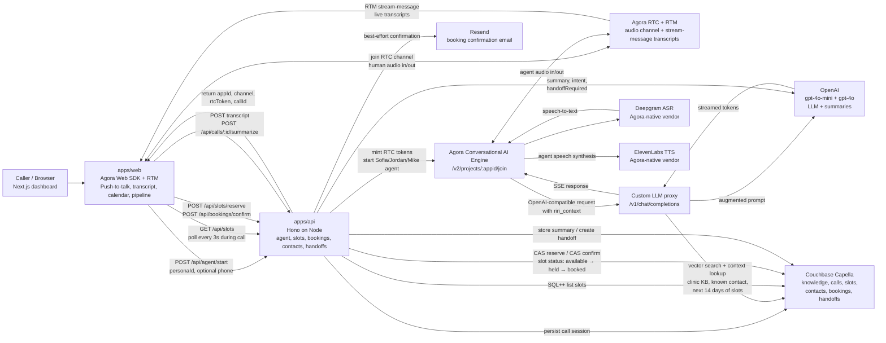

# Riri

> Voice AI receptionists — with the personality of a real closer. *I'm Rocky — but for you.*

Built for the **Agora Hackathon Philippines 2026** in 7 hours by a team of 4.

V0 is a voice receptionist for **Belle Aesthetic Manila** — a derma / aesthetic clinic in BGC. The persona is **Sofia**: warm, professional, photographic memory of every service, doctor, and returning client. She answers the phone, handles price objections with the package playbook, locks an appointment slot atomically against the calendar, and sends a confirmation email before the caller has hung up.

Jordan (high-energy phone closer) and Mike (calm consultative B2B closer) live in the codebase as alternative personas to demo the **persona engine** — same Agora voice quality, same Couchbase RAG brain, different soul.

Under the hood: Agora Conversational AI Engine for real-time voice (sub-650ms latency, native interruption handling), Couchbase Capella for vector RAG + operational data, ElevenLabs for voice, Deepgram for speech-to-text, OpenAI as the LLM brain, and Resend for transactional confirmation emails.

## Architecture



**Runtime flow:**

1. The browser calls `POST /api/agent/start` with a selected persona (`sofia`, `jordan`, or `mike`) and optional caller phone number. The API looks up known contacts in Couchbase Capella, mints Agora RTC tokens, then starts an Agora Conversational AI Engine agent.
2. The browser and the AI agent meet inside the same Agora RTC channel. Audio flows through Agora RTC; transcript events come back over Agora RTM stream messages and render live in the dashboard.
3. Agora handles speech vendors natively: Deepgram turns caller speech into text, and ElevenLabs turns the LLM response back into Sofia's voice.
4. For every turn, Agora calls our OpenAI-compatible `/v1/chat/completions` endpoint. The proxy retrieves relevant clinic knowledge from Couchbase Capella, injects Sofia-only context (`AVAILABLE_SLOTS` and `CONTACT`), then streams OpenAI tokens back to Agora.
5. Booking actions go through the Hono API. Slot reservation uses a Couchbase CAS replace, so only one caller can move a slot from `available` to `held`; booking confirmation moves it to `booked`, writes the booking/contact history, and sends a best-effort Resend confirmation email.
6. After the call, the frontend posts the transcript and asks the API to summarize. The summary includes lead score, intent, requested service/doctor/time, objections handled, cited sources, and whether a human handoff is required.

**Key design choice:** Agora's `llm.url` field accepts any OpenAI-compatible endpoint. We stand up our own `/v1/chat/completions` proxy that injects RAG context from Couchbase on every turn. For Sofia we additionally inject the next 14 days of available slots and a known-contact block. This keeps voice latency low (no extra LLM round-trip for tool calls) and gives us full control over how knowledge flows into the agent.

## Agora Integration

- **Agora Conversational AI Engine REST** `/v2/projects/:appid/join` is wired in [apps/api/src/lib/agora.ts](apps/api/src/lib/agora.ts) — we mint two RTC tokens (one for the agent UID, one for the human UID), then POST to Agora's start endpoint with our persona, ASR vendor, TTS vendor, and `llm.url` pointing at our proxy.
- **Custom LLM endpoint** lives at `/v1/chat/completions` in [apps/api/src/routes/llm.ts](apps/api/src/routes/llm.ts). It is OpenAI-compatible (Agora calls it as if it were OpenAI itself), but on every turn we run a vector search against Couchbase Capella, inject a CONTEXT block (+ AVAILABLE_SLOTS + CONTACT for Sofia), then stream the augmented completion back as SSE.
- **Agora Web SDK + RTM + stream-message for transcripts** is wired in [apps/web/lib/agora.ts](apps/web/lib/agora.ts). The browser joins the same RTC channel as the agent, subscribes to remote audio, and listens to RTM stream messages to render live transcripts in [components/TranscriptPanel.tsx](apps/web/components/TranscriptPanel.tsx).
- **Deepgram ASR + ElevenLabs TTS configured as Agora-native vendors** in `apps/api/src/lib/agora.ts` (`asr: { vendor: "deepgram" }`, `tts: { vendor: "elevenlabs" }`). Agora pipes mic audio to Deepgram for STT and pipes our LLM tokens to ElevenLabs for TTS without touching our backend.

## Repo Layout

```
Riri/
  apps/
    web/         # Next.js 14 dashboard + push-to-talk widget
                 #   page.tsx: stats strip, persona switcher, push-to-talk,
                 #             live calendar, transcript, sources, handoffs,
                 #             pipeline board
                 #   summary/[callId]/page.tsx: lead score hero + objections
    api/         # Hono backend - agent control, LLM proxy, ingest, post-call,
                 # clinic slots/bookings/contacts/handoffs, catalog
  packages/
    shared/      # Zod schemas + TS types (frozen API contracts)
    personas/    # JSON definitions of Sofia, Jordan, Mike
  docs/
    DEMO_SCRIPT.md      # 5-minute pitch script (clinic flow)
    INTERFACES.md       # API contracts mirrored from packages/shared
    PITCH_PROMPTS.md    # System prompts for the personas (iterable)
    SUBMISSION.md       # Hackathon submission checklist
  infra/
    couchbase-vector-index.md   # Exact JSON to create the Capella vector index
```

## Quick Start

```powershell
# 1. Install dependencies (one-time)
pnpm install

# 2. Configure environment
Copy-Item .env.example .env
# Edit .env and fill in Agora, OpenAI, ElevenLabs, Deepgram, Resend, Couchbase keys

# 3. Set up Couchbase Capella
# - Sign up at https://cloud.couchbase.com (free tier)
# - Create a cluster, bucket named "Riri"
# - Default scope, create these collections:
#     knowledge, calls, slots, contacts, bookings, handoffs
# - Create vector search index per infra/couchbase-vector-index.md

# 4. Seed the demo data
pnpm seed:clinic     # V0: clinic KB, 14 days of slots, contacts, bookings
# Optional: pnpm seed:company && pnpm seed:prospect (B2B demo for Jordan/Mike)
# Or: pnpm seed:all to run all three

# 5. Expose the API publicly (Agora needs to reach our LLM proxy)
# In a separate terminal:
# cloudflared tunnel --url http://localhost:3001
# (or: ngrok http 3001)
# Update LLM_PROXY_URL in .env with the public URL it gives you

# 6. Run both apps
pnpm dev
# - Web:  http://localhost:3000
# - API:  http://localhost:3001
```

## Team / Roles (4 engineers, 7 hours)

- **Voice / Tech Lead** — Agora end-to-end + integration ownership. Owns `apps/api/src/routes/agent.ts`, `apps/api/src/lib/agora.ts`, `apps/web/lib/agora.ts`. Branch prefix `voice/*`.
- **Brain / Backend** — Couchbase + LLM proxy + RAG + slot CAS + Resend. Owns `apps/api/src/routes/{llm,calls,slots,bookings,contacts,handoffs}.ts`, `apps/api/src/lib/{couchbase,resend,rag,openai}.ts`, seed scripts. Branch prefix `brain/*`.
- **UI / Frontend** — Dashboard + push-to-talk + transcript + calendar grid + pipeline. Owns `apps/web/app/*`, `apps/web/components/*`. Branch prefix `ui/*`.
- **Story / Product / Pitch** — Persona prompts, demo content, pitch deck. Owns `packages/personas/*.json`, `docs/DEMO_SCRIPT.md`, `docs/PITCH_PROMPTS.md`, the pitch deck. Branch prefix `story/*`.

See [docs/PLAN.md](docs/PLAN.md) for the original hour-by-hour plan (the clinic pivot is layered on top of it).

## Branch Strategy

- `main` — protected, deploy target
- Each engineer works on `<role>/*` branches and PRs to `main`
- Voice/Tech Lead is the integration owner and merges to `main`
- **Hard integration gate: 1:30 PM** — press the button, Sofia talks, calendar updates, email lands. If not, all V1 stretch features are cancelled.

## Sponsor Hooks (for the pitch)

- **Agora** — Conversational AI Engine + Web SDK + Web Toolkit (sub-650ms latency, interruption handling, custom LLM proxy)
- **Couchbase Capella** — Vector search powers the clinic RAG brain. Slots / contacts / bookings / handoffs all live in the same engine, with the slot reservation flow using a Couchbase CAS replace as a multi-writer-safe lock.
- **Resend** — Booking confirmation emails. Sent the moment Sofia confirms verbally. Free tier is enough for the hackathon.
- **TRAE / Cursor / Claude Code** — shipped the whole thing in 7 hours with AI coding tools
- **AWS** — backend deployable to App Runner / EC2 / Lambda

## Known Limitations

V0 is a demo, not a production system. We explicitly cut the following to ship in 7 hours:

- **No real auth or multi-tenant signup.** Anyone with the URL can start a call. Fine for a hackathon demo; not fine for paying customers.
- **No real CRM / EMR integration.** Contacts, bookings, and handoffs live in Couchbase Capella but do not sync to Salesforce, HubSpot, or any clinic EMR.
- **No real billing or rate limiting.** OpenAI / Agora / ElevenLabs minutes are billed to our keys directly.
- **English-only voice.** Sofia is English-tuned; Tagalog or Taglish would need a separate ElevenLabs voice and a persona-prompt tweak.
- **No outbound calling / SIP.** Inbound concierge only. Outbound is on the roadmap.
- **No persona editor UI.** Editing personas means editing the JSON files.
- **No automatic rescheduling flow.** Sofia can take a reschedule intent but the booking flow is one-way (book → confirm) for V0. Rescheduling is on the roadmap.
- **Resend uses the shared `onboarding@resend.dev` sender** unless `RESEND_FROM_EMAIL` is set to a verified domain. Production deployments must verify a domain in Resend.
- **No HIPAA / data-residency claims.** This is a Philippine clinic demo. Anything sensitive should not be sent through OpenAI without a BAA.
- **Slot reservation TTL is global (5 minutes).** Real clinics may want per-service hold durations.

## Demo Recipe (the killer 5 minutes)

See [docs/DEMO_SCRIPT.md](docs/DEMO_SCRIPT.md).

---

Built with **TRAE + Cursor + Claude Code**.
